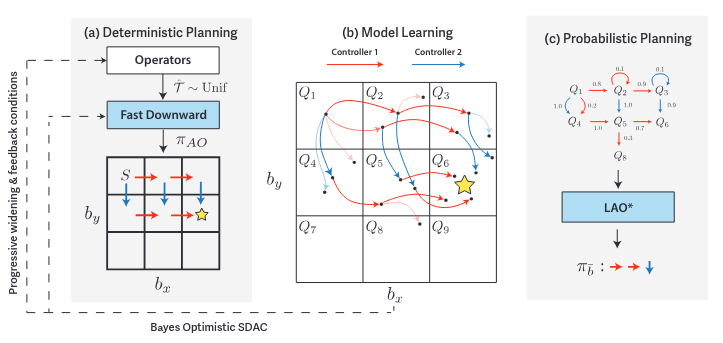
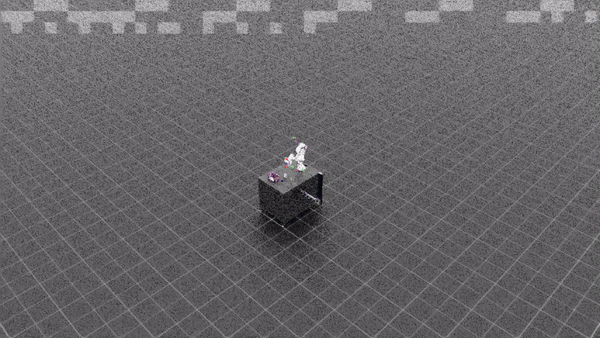
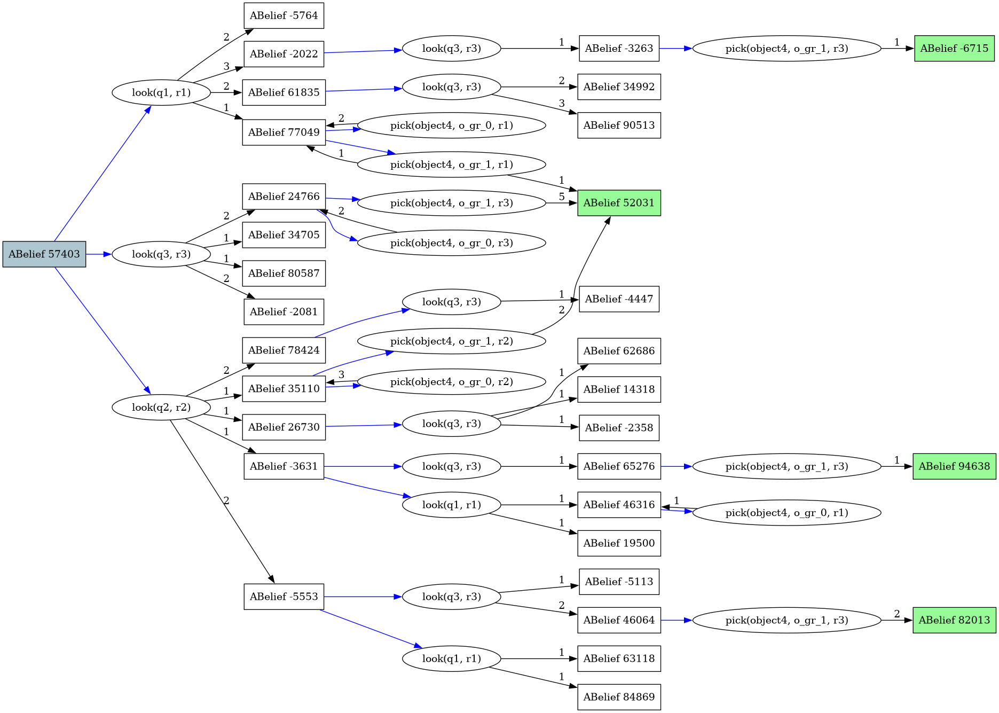

# Uncertainty and Risk Aware Task and Motion Planning

## _Note_
_This repository contains explanation, code and demonstrations for my reseach assignment at the [Autonomous Multi-Robots Lab](https://autonomousrobots.nl/) in the second year of my Master Robotics program at the Technical University of Delft. The aim of this assignment was to implement a baseline for uncertainty and risk-aware task and motion planning. For this purpose, [TAMPURA](https://arxiv.org/pdf/2403.10454) was the chosen algorithm. Two example scenarios of this problem have been impmlemented and demonstrated below._

While Integrated Task and Motion Planning (TAMP) (Garrett et. al., [2020](https://arxiv.org/pdf/2010.01083)) offers a valuable approach to generalizable long-horizon robotic manipulation and navigation problems, the typical TAMP formulation assumes full observability and deterministic action effects. These assumptions limit the ability of the planner to gather inforamtion and make decisions that are risk-aware. Curtis et. al. [2024](https://arxiv.org/pdf/2403.10454) present TAMP with Uncertainty and Risk Awareness (TAMPURA) as an efficient way to solve long-horizon planning problems with initial-state and action outcome uncertainty. TAMPURA uses sequences of controllers for short-time manipulation tasks for long-horizon planning in a deterministic fashion. It extends TAMP with partial observability, uncertainty and a coarse knowledge of the controllers' preconditions and effects. The main algorithm is illustrated below.

<p align="center">
  
</p>


Using “templates” that define preconditions and effects for each operator, the symbolic planner solves for multiple all-outcomes determinized plans to the goal abstract belief state. These plans are then evaluated using a mental simulation to approximately learn the transition and reward models for the MDP. The MDP is then solved to obtain a policy which takes belief states as inputs and outputs a suitable controller.

## Status
Two TAMPURA scenarios from Curtis et. al. [2024](https://arxiv.org/pdf/2403.10454) have been implemented and simulated on [Isaac Lab](https://isaac-sim.github.io/IsaacLab/main/index.html). Two demonstrations for each scenario are shown below. For both files, `num_samples`, `batch_size` and `num_skeletons` can be changed in the `cfg` dictionary passed to the planner. Increasing `num_samples` would help learn the MDP more closely, and increasing `num_skeletons` will ensure that the symbolic planner explores more deterministic plans to the goal state. Increasing them is recommended for highly complex problems with large branching factors.

### Class Uncertainty
A [robot arm](https://robodk.com/robot/Franka/Emika-Panda) is mounted to a table with 4 objects placed in front of it, with at least one bowl in the scene. The robot must place all objects of a certain class (here, green blocks) in the bowl. 
Classification noise is added to ground truth labels to mimic the confidence scores typically returned by object detection systems.
The agent can gain more certainty about an object category by inspecting the object more closely with a wrist mounted camera (the use of a camera is ommitted in this implementation and the agent queries the environment to gain certainty about the object class). A reasonable
strategy is to closely inspect objects and stably grasp and place them in the bowl. The planner has access to the following controllers:
Pick(?o ?g ?r), Drop(?o ?g ?r), Inspect(?o),
for objects o, grasps g, and regions on the table r. 
This is done in a closed loop fashion, i.e., if the agent believes that the object has fallen from the gripper, it will repeat the Pick action.

This scenario corresponds to the [`class_uncertainty.py`](/tamp_uncertainty/class_uncertainty.py) file with the environment setup files [`class_uncertainty_ik_abs_env_cfg.py`](/tamp_uncertainty/class_uncertainty_ik_abs_env_cfg.py) and [`class_uncertainty_joint_pos_env_cfg.py`](/tamp_uncertainty/class_uncertainty_joint_pos_env_cfg.py).

*(In this example, the stability of grasps is ommitted. It is implemented in the search object scenario.)*

<p align="center">
  
</p>

<p align="center">
  
</p>

### Searching for an object in a cluttered environment 
In this task, the agent has 4 objects placed in front of it with exactly one die hidden
somewhere in the scene such that it is not directly visible. The
goal is to be holding the die without dropping any objects.
The robot must look around the scene for the object, and may
need to manipulate non-target objects under certain kinematic,
geometric, or visibility constraints. The planner has access to
Pick(?o, ?g), Place(?o, ?g), Look(?o, ?q) controllers for this task.
Further, the object grasps have unknown probabilty of success, which may be determined 
during the mental simulations for learning the MDP.

This scenario corresponds to the [`search_object.py`](/tamp_uncertainty/search_object.py) file with the environment setup files [`search_object_ik_abs_env_cfg.py`](/tamp_uncertainty/search_object_ik_abs_env_cfg.py) and [`search_object_joint_pos_env_cfg.py`](/tamp_uncertainty/search_object_joint_pos_env_cfg.py).

<p align="center">
  
</p>

<p align="center">
  
</p>

### Comments
Planning takes about 5-7 seconds for the search object problem and 9-11 seconds for the class uncertainty problem,
making it slow for real-world application. 
Few of the planning hyperparameters were tuned according to the complexity of the problem. The most important one is `num_skeletons` which 
is the number of deterministic plans generated by the symbolic planner. If this was not high enough to cover multiple viable 
solutions to the goal (abstract belief) state, the planner often solved for a suboptimal policy. The transition models were visualized for each learning iteration to 
gain insight into how the MDP was learnt. When the goal state is not reachable in the mental simulations
(insufficient number of plans, ill-defined operators, ill-defined mental simulation), a sub-optimal action is often recommended by the solver. 
This often results in the planner repeating the action which always fails. When the goal is not reachable, the planner cannot decide which intermediate state is 
desirable to get to the goal, which results in choosing bad actions. Further, this action is often not applicable in the current belief state. 
In this case, an action is chosen randomly from the set of applicable actions.
Due to poorly defined operators or ending up at a “dead end” state, there are often no viable plans to the goal state, resulting in a symbolic planner failure.
To avoid this, overengineering the preconditions of actions resolved the problem to some extent, but is not the ideal way to proceed. 
It was observed that a (qualitatively) optimal policy is learnt when the goal state is reachable in the transitions.
To learn the MDP more accurately, a higher number of samples must be considered for each planning step, especially for problems with a high branching factor.
The planner can operate in closed-loop fashion, but does not learn the MDP from the environment yet.
An exaample of a transition model with the goal state being reachable is shown below.

<p align="center">
  
</p>


## Installation notes

Git clone the following repositories in root of this repository: isaac lab, tampura.
    
```bash
git clone https://github.com/isaac-sim/IsaacLab.git 
git clone https://github.com/aidan-curtis/tampura.git
```

You may decide to keep the tampura source code as part of this repo if you plan to make changes to it.

Build the symbolic solver for tampura. 
    
```bash
cd tampura/third_party/symk
python build.py
```

Create the virtual environment and install the dependencies. This is automatically done by using [uv python](https://docs.astral.sh/uv/getting-started/installation/) package manager.

```bash
cd <path to repository root>
uv venv
source .venv/bin/activate
uv sync
```

This should have installed isaac sim, tampura and isaac lab. Isaac lab is specially problematic, so consider installing it manually instead of using uv sync if it gives problems (using the instructions in the isaac lab repository for python env installation).

To add more dependencies, just run `uv add <package>` (instead of `pip install <package>`). You can also add them by hand in the `pyproject.toml`. 
More information about dependencies specification can be found [here](https://docs.astral.sh/uv/concepts/dependencies/).

## TAMPURA files

The python files required for the two TAMPURA task scenarios are available in the `tamp_uncertainty` directory. These must be placed in the appropriate location in the local `IsaacLab` directory to run them. The following instructions are for the class uncertainty task and are similar to the search for object in clutter task with the file names changed.

In the terminal, working from root of the repository, move the `tamp_uncertainty` directory to the following location in the local installation of `IsaacLab`.


```bash
cp -r tamp_uncertainty IsaacLab/source/extensions/omni.isaac.lab_tasks/omni/isaac/lab_tasks/manager_based/manipulation/lift/config
```

The scripts should be ready for execution. To run `class_uncertainty.py`, type in the following in the terminal from the root of the repository

```bash
python IsaacLab/source/extensions/omni.isaac.lab_tasks/omni/isaac/lab_tasks/manager_based/manipulation/lift/config/tamp_uncertainty/class_uncertainty.py --num_envs 1
```
